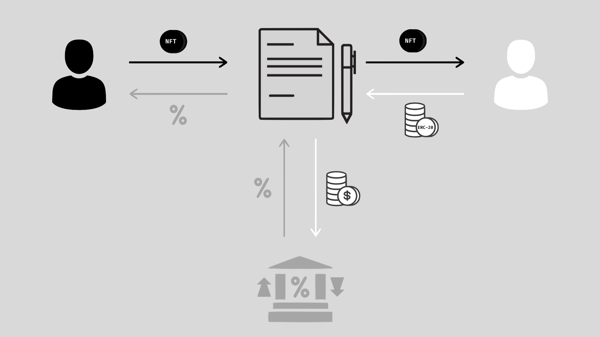

# Getting Started

The Neftify protocol enables the seamless exchange of the time value between ERC-20 and ERC-721 tokens on Ethereum. It opens up new avenues for more sophisticated functionality between these two asset markets beyond outright swaps. The protocol is intended to be fully decentralized, prioritizing security, censorship resistance, and community control over the exclusive benefits that come with traditional centralization; Neftify is a public good. 

For the first version of the protocol, the central team will maintain control over the protocol until it is able to develop it into a viable DAO. After v1, the team will launch v2 and hand over control of the protocol to the community following Jesse Walden’s [Progressive Decentralization](https://a16z.com/2020/01/09/progressive-decentralization-crypto-product-management/) playbook. 

Neftify’s technical docs can be found [here](https://docs.neftify.com). They serve as a project overview for how Neftify works, how to use it, and how to build on top of it. These docs are actively maintained and updates will be added on an ongoing basis.

# How It Works
Neftify’s main contract, neftiswap, is the primary entry point for all interactions that take place with the protocol. It automates the asset swap that takes place when a user puts up collateral to borrow an NFT by supplying that collateral to an external interest rate protocol. For now, the collateral is deposited individually as opposed to being pooled together.

# How to Use It

# Resources
➢ [Website](https://neftify.com)
➢ [Github](https://github.com/neftify)
➢ [Twitter](https://twitter.com/neftify)
➢ [Reddit]()
➢ [Discord]()
➢ [Email]()
➢ [Docs](https://docs.neftify.com)
➢ [Whitepaper](https://neftify.com/neftify-whitepaper.pdf)
